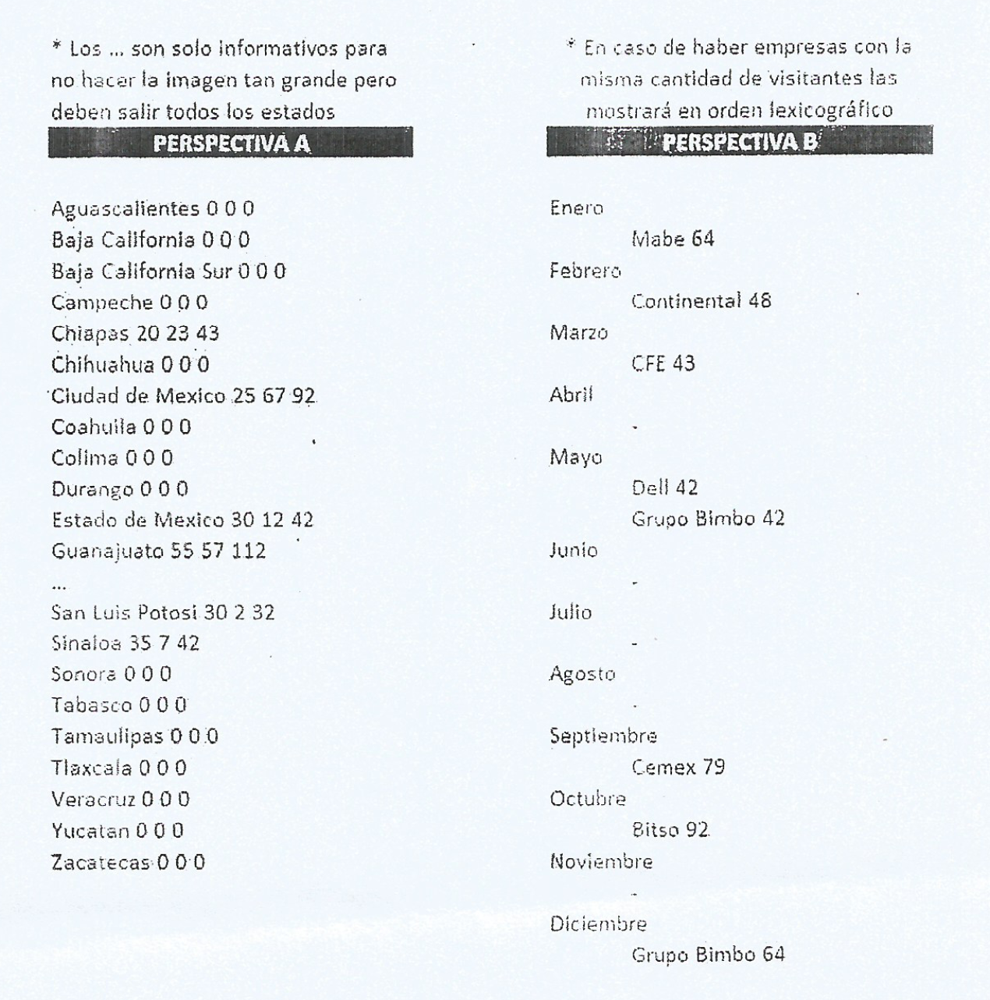
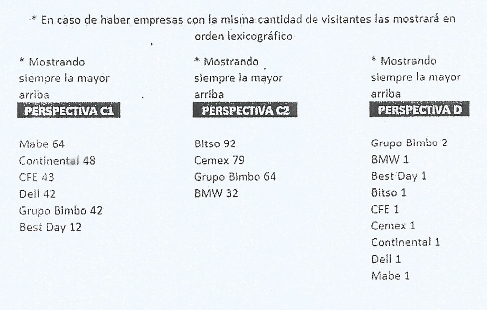

# Problem E - Date prisa Carlitos!
  
**Time Limit:** 1 second
  
---
 
## Description
Carlitos es un estudiante del TecNM, está haciendo su servicio social en el departamento de estadística y a unas horas del Coding Cup, le han dejado muchas actividades que tiene que terminar o no podrá participar en el concurso, el cual espera muy emocionado. Le han pedido que analice y obtenga datos de las visitas a empresas que ha realizado su campus del TecNM.

Le han dicho que es urgente generar esa información, y a que de ello depende que su campus pueda afrontar de mejor manera una auditoría en los próximos días. Esta tarea consiste en concentrar información de las visitas a empresas realizadas a lo largo del año a diferentes empresas ubicadas en todo el país. Y en caso de no terminar no tiene permiso para participar en el Coding Cup pues debe entregar los resultados de su análisis el mismo día que es el concurso.

Le han pasado una lista con las visitas realizadas y debe obtener la información concentrada de diversas formas, por ello Carlitos se siente presionado porque cree que si lo realiza de manera manual no terminará y si de repente le piden analizar los datos de otros años su trabajo se iría a la basura pues tendría que hacerlo de nuevo (situación que ya le ha pasado antes). Ha concluido que debería realizar un programa que le ayude con esta tarea pero aun así no cree terminar antes del Coding Cup y Carlitos está estresado y desanimado, ayuda a Carlitos con sus asignaciones a fin
de que pueda participar y al terminar el concurso Carlitos tenga lista la información que necesita.

El departamento de estadística le ha dicho a Carlitos que la información puede concentrarse con 4 perspectivas distintas:

Ejemplo de salidas para las perspectivas A y B


Ejemplo de salidas para las perspectivas C Y D


---
  
## Input
En la primera línea un entero V, que indica el número de visitas realizadas en el año. 
Enseguida V líneas con los datos de cada visita separados por comas, cada visita contiene el nombre de la empresa, estado donde se encuentra, ciudad específica donde se localiza, cantidad de hombres, cantidad de mujeres y la fecha en la que se realizó la visita.

Posteriormente, un entero P que indica cuántas perspectivas distintas se requiere para el concentrado de la información, seguido de P líneas con la perspectiva a generar de la información.
  
## Output
De acuerdo a cada perspectiva:
    - A: se mostrará para cada estado de la republica la cantidad de hombres, mujeres y total de visitantes separados por un espacio
    - B: se motrará cada mes del año y en la siguiente linea con un tabulador el nombre de la empresa o empresas con mas visitas y el numero de visitantes para cada una, en caso de no haber visitas colocar un guion.
    - C: este tipo de operacion vendra seguida de un 1 o un 2 para indicar cual semestre del año se desea consultar, en ambos casos se mostrará una la lista de empresas visitadas (sin importar ubicacion).
    - D: mostrar las empresas y el numero de sedes visitadas.

Nota: despues de cada perspectiva debes dejar una linea en blanco para separar la información.
  
## Sample Input
```
10
Ciudad de Mexico, Ciudad de Mexico, Bitso,25,67,12/10/2024
Guanajuato, Silao, Grupo Bimbo,30,34, 12/12/2024
Quintana Roo, Cancun, Best Day, 10,2,01/01/2024
Queretaro, Queretaro, Mabe, 30,34, 12/01/2024
Guanajuato, Irapuato, Continental, 25,23, 15/02/2024
Chiapas, Tuxtla Gutierrez, CFE,20,23,27/03/2024
Estado de Mexico, Atizapan de Zaragoza,Dell, 30, 12,23/05/2024
Sinaloa, Culiacan, Grupo Bimbo,35,7,23/05/2024
San Luis Potosi, San Luis Potosi, BMW,30,2, 12/09/2024
Hidalgo, Pachuca, Cemex,45,34,02/09/2024
2
D
C2
```

## Sample Output
```
Grupo Bimbo 2
BMW 1
Best Day 1
Bitso 1
CFE 1
Cemex 1
Continental 1
Dell 1
Mabe 1

Bitso 9 2
Cemex 79
Grupo Bimbo 64
BMW 3 2
```