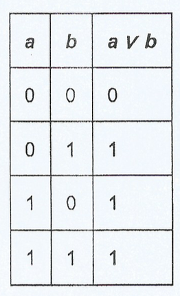

# Problem G - Lógica Binaria
  
**Time Limit:** 1 second
  
---
 
## Description
Antonia acaba de iniciar su curso de lógica binaria, y en su primera clase le han enseñado la operación ∨ (OR o disyunción lógica), la cual tiene la siguiente tabla de verdad para dos entradas a, b.
  

  
De manera similar Antonia aprendió que es posible realizar esta operación para la representación binaria de números enteros, ejemplo:
5 ∨ 3 = 7 = (101)₂ ∨ (011)₂ = (111)₂.

Antonia es una chica muy proactiva así que se ha planteado el siguiente problema:
Dado un número N, ¿cuál es la menor cantidad de números consecutivos en orden descendente necesarios para que el resultado de aplicar la operación ∨ (OR) sea de la forma (00…01…11)₂, es decir que no existan ceros intermedios una vez que aparece el primer bit 1.

---
  
## Input
Un entero N en la única línea de entrada.
  
## Output
Una línea de salida con un entero igual a la respuesta solicitada.
  
## Sample Input
```
15
```

## Sample Output
```
1
```