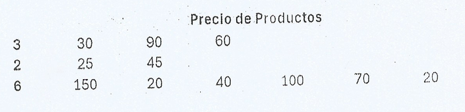

# Problem H - Inflación Estilo de Vida
  
**Time Limit:** 1 second
  
---
 
## Description
Espino recientemente terminó sus estudios como Ingeniero de Software, y ha conseguido un nuevo empleo como desarrollador. Como es el primer empleo de Espino, y como nunca ha tenido mucha preparación financiera (La Universidad de Espino era muy buena para enseñar sobre programación y algoritmos, pero no muy buena en términos de finanzas básicas) está teniendo problemas sobre cómo administrar su dinero, no sabe si ahorrarlo, ahorrar una parte y gastar un poco de la otra, o gastarlo todo.

Al llegar su primer cheque, Espino primero pagó la renta de su departamento y con el sueldo restante, decidió comprar una buena Televisión, pero luego pensó que si ya tenía una buena Televisión, se llevaría bien con un buen sistema de sonido, después, contratar todas las subscripciones de Streaming, y que sería de un buen sistema de Televisión con sonido sin las consolas de última generación y una PC Gamer, buenos muebles, iluminación ambiente y un buen sistema de Internet. Finalmente Espino gastó la mayor parte de su sueldo, iniciando con una “inocente compra”.

Ya que Espino decidió hacer todas estas compras no tan sabias, tu tarea es ayudarlo a comprar un producto de cada una de las N categorías que Espino quiere, pero tratando de comprar la que esté más cara de cada categoría (Porque por alguna razón, Espino piensa que si cuesta más es mejor), siempre y cuando le alcance para pagarla.
  
  
---
  
## Input
En la primera línea de entrada, un entero N que representa la cantidad de diferentes productos que Espino desea comprar y un entero M que representa el presupuesto disponible de Espino, después de pagar la renta y otras cuentas por pagar.

En las siguientes líneas de entrada, como se muestra en la imagen, se proporcionará una matriz con los productos que quiere Espino, con su precio correspondiente.


## Output
Un número entero que representa el mayor número que Espino pueda gastar, comprando cada producto con el mayor precio posible, siempre y cuando lo pueda pagar.

En caso de que no pueda comprar todos los productos, al menos uno de cada uno, debes imprimir -1.
  
## Sample Input
```
3 120
3 30 90 60
2 25 45
6 150 20 40 100 70 20
```

## Sample Output
```
115
```