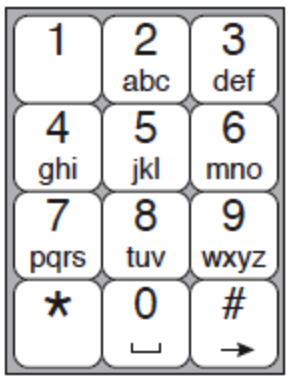

# Problem C - SMS Championship

** Time Limit:**

--

## Description

The Just Crazy Cellphone, a renowned company in the field of mobile telephony promotes a championship of text messages every year. In this competition, the winner is who type faster a given message. The oficial equipment of the competition, of mandatory use, has a simple keyboard, similar to the cellphone you probably will have in your pocket if they were not prohibited during Programming Marathons. The keyboard has the following layout:



---

As it is only allowed to use the thumb to press the keys, all of them were made in a square format with a side of 1 centimeter, without spaces between two adjacent keys. The keys 2 to 9 are used to type the letters 'a' to 'z', and they work like any other cellphone: if we want one of the associated letters of that key, we must press that key the same number of the position of the letter. For example, pressing the key 3 once, we get 'd'. If we press it again, we get 'e' and again we get 'f'. If we continuing pressing this same key, we have the number '3' and then restart in 'd'. The key 0 is used to insert spaces in the message; the keys 1 and * are not used in this competition.

In the case of two consecutive letters that are formed by the same key, it will be necessary to use the key #. The function of this key is separate the pressing sequences of two letters of same key. For example, to write the word "cake", the sequence of tightening keys should be: 2, 2, 2, #, 2, 5, 5, 3, 3.

To make things more interesting, the organization had decided that in this year the message must be written in free fall: the competitors jump from a plane with the cellphone in your hands and then types the message; a sofisticated computer system will open the parachute automatically when the message is totaly typed without mistakes. However, this modification in the rules has introduced a new difficulty: to avoid the loss of the cellphone during the fall, it is necessary use one thumb to hold the equipement while the other thumb presses a key or it's moved, which implies that one of the thumbs will be kept fixed.

To satisfy the curiosity of the public, you were hired to make a computer programm that, given a message with up to 140 characters, tells the minimum time necessary for one competitor to type it on the cellphone. Supose that this competitor can move his thumbs in the incredible velocity of 30 centimeters per second, takes to 2 tenths of second to press one key, starts the free fall with the left thumb under the key 4, the right thumb under the key 6 and always press the keys perfectly in the center.

---


## Input
The input contains many test cases. Each test case is composed by a message, a string containing from 1 to 140 characters ('a'-'z' ou ' '), inclusive. None message begins or ends with spaces and neither contains accents or two consecutive spaces. The end of input is indicated by the end of file (EOF).

## Output
For each test case, print one line containing the time, in seconds, that our ideal competitor will take to type the given message. Use two decimals to present the answer.

## Sample Input
```
gol
ogro
casa
garra
paraquedas com defeito
```

## Sample Output
```
1.43
2.03
2.19
2.23
10.10
```
