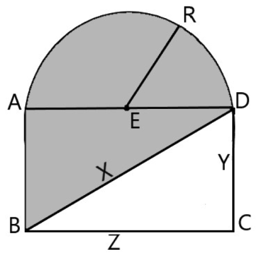

# Problem J - Cofre Dañado
  
**Time Limit:** 1 second
  
---
 
## Description
El Sr. Moacir guarda en casa un objeto muy importante para su familia: un cofre de madera de los años 50. Mientras limpia su ático, nota que la madera del objeto está dañada y decide restaurarla. Se sabe que la madera sólida es un material costoso, por lo que Moacir decide restaurar solo el área dañada.

La figura de abajo corresponde al lado del cofre. La parte oscura de la figura corresponde al área dañada que necesita ser restaurada.



Understanding that ER is the radius of the semicircle, in which the center is E, your program must determine the value of the area that will be restored, given the values of X, Y and Z.

Note: Consider for this problem π = 3
---
  
## Input
La entrada consta de tres números enteros N (1 ≤ N ≤ 1000), que indican los valores de X, Y y Z, respectivamente.

## Output
La entrada consta de tres números enteros N (1 ≤ N ≤ 1000), que indican los valores de X, Y y Z, respectivamente.

## Sample Input
```
13 5 12
```
---
```
2 1 1
```

## Sample Output
```
AREA = 84
```
---
```
Nao eh retangulo!
```